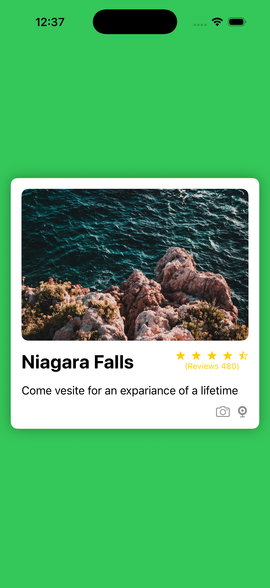

# Learn iOS Development

This repository contains my iOS learning journey with daily projects and exercises using Swift and SwiftUI.

---

## 📅 Daily Progress

### Day 01
A foundational SwiftUI project demonstrating basic app structure and UI components.

**Screenshot:**

---

## 🚀 Getting Started

Each day contains a complete Xcode project. To run any day's project:

1. Navigate to the day's folder
2. Open the `.xcodeproj` file in Xcode
3. Select a simulator or device
4. Press `Cmd + R` to build and run

---

## 📚 What I'm Learning

- Swift programming fundamentals
- SwiftUI for building user interfaces
- iOS app architecture and structure
- State management
- Navigation and view composition

---

## 📝 Notes

Each project is self-contained and demonstrates specific iOS development concepts.

---

**Last Updated:** January 30, 2026
